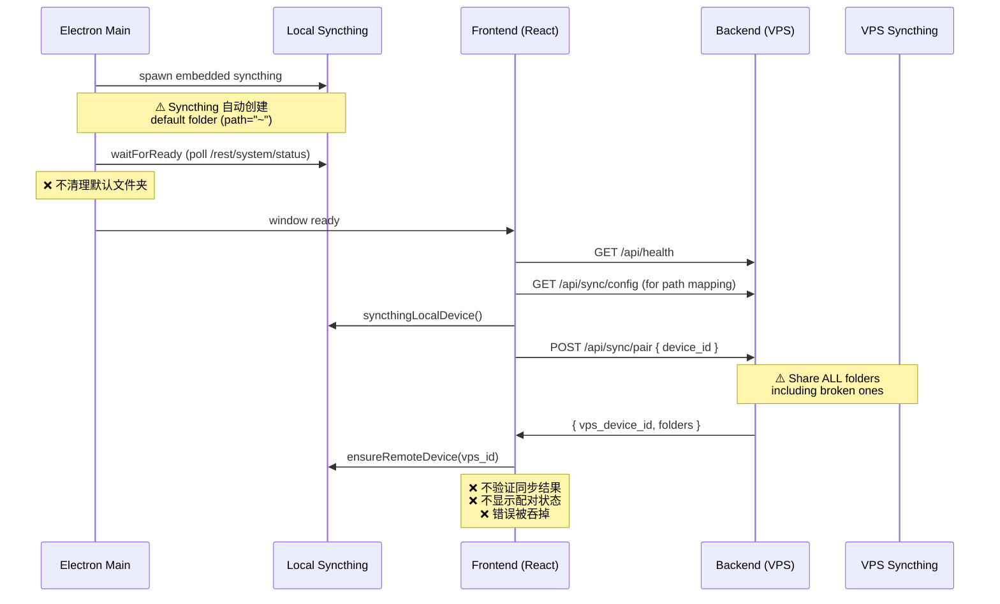

# 🔍 Syncthing 模块完整审计

## 当前 VPS 实际状态

| 项目 | 值 |
|------|-----|
| 进程 | ✅ 运行中 (PID 318327, port 8384) |
| 文件夹数量 | 2 |
| `default` | path=`/root/Sync`, label="Default Folder" |
| `nono-bc566d1c` | path=`~/Contracts`, label="Contracts" |
| 已配对设备 | `LAPTOP-E0LKJMHC Desktop` (你的 Windows) |
| 幽灵文件夹 | ✅ 已清除 (id="" 已不存在) |

> [!WARNING]  
> `nono-bc566d1c` 的路径仍然是 `~/Contracts`（未展开），需要修正。
> API 在高并发下容易超时挂起（多个 Python 进程同时连接时导致锁死）。

---

## 后端 API 清单

| 端点 | 方法 | 用途 | 前端是否调用 |
|------|------|------|-------------|
| `/api/sync/config` | GET | 返回文件夹路径映射（给 SyncPathResolver） | ✅ `utils.ts` |
| `/api/sync/pair` | POST | 注册桌面设备，share 所有文件夹 | ✅ `App.tsx` autoPair |
| `/api/sync/folders` | POST | 桌面发送新文件夹，VPS 创建接收目录 | ✅ `sync-folder-widget.tsx` |
| `/api/sync/folders` | GET | 列出所有同步文件夹及状态 | ✅ `sync-folder-widget.tsx` |
| `/api/sync/folders/{id}` | DELETE | 移除同步文件夹 | ✅ `sync-folder-widget.tsx` |
| `/api/sync/status` | GET | 实时同步状态（设备连接、文件夹状态） | ✅ `use-sync-status.ts` |

**结论：后端 API 齐全，6 个端点都有前端调用。**

---

## 前端组件清单

| 组件 | 位置 | 功能 | 可见性 |
|------|------|------|--------|
| `useSyncStatus` hook | `hooks/use-sync-status.ts` | 轮询 `/api/sync/status`，返回连接状态 | 数据层 |
| Sidebar sync indicator | `sidebar.tsx` L270-286 | 显示 ☁️Synced / 🔄Syncing / ☁️❌Disconnected | ✅ 底部小图标 |
| Settings sync label | `settings-dialog.tsx` L204-210 | 显示 "File sync active/disconnected" | ✅ 一行文字 |
| `SyncFolderWidget` | `sync-folder-widget.tsx` | 添加/查看/删除同步文件夹 | ⚠️ **只在输入框底部，不够醒目** |
| `SyncPathResolver` | `deliverables/utils.ts` | 路径映射（VPS→本地） | 内部逻辑 |

---

## 用户体验断裂点

### 1. ❌ 没有"同步概览"页面

当前唯一能看到同步信息的地方：
- Sidebar 底部一个小图标（Synced/Disconnected）
- Settings 弹窗里一行文字
- 输入框底部的 SyncFolderWidget 按钮（需要先有 `nono-` 前缀的文件夹才能看到列表）

**用户看不到**：
- 哪些文件夹在同步
- 每个文件夹的同步进度
- 设备连接状态详情
- 同步错误和诊断信息
- 路径映射关系（VPS 路径 → 本地路径）

### 2. ❌ SyncFolderWidget 过滤了系统文件夹

```typescript
// sync-folder-widget.tsx L108-111
const nonoFolders = (data.folders || []).filter(
  (f: any) => f.id.startsWith("nono-")  // ← 只显示 nono- 前缀的文件夹！
);
```

你的实际文件夹是 `default` 和 `nono-bc566d1c`。
`default` 文件夹（也就是 Agent 的主工作区 `/root/Sync`）被完全隐藏了！
用户完全看不到最重要的同步文件夹。

### 3. ❌ 初始化完全静默

```typescript
// App.tsx L670-715
const autoPairSyncthing = useCallback(async () => {
    // ... 全程 try/catch，错误被吞掉
    } catch {
      // Silent fallback
    }
});
```

如果配对失败（比如 Syncthing 没启动、网络超时），用户完全不知道。

### 4. ❌ 没有配对状态反馈

用户无法知道：
- 是否已经成功配对
- VPS 和桌面的 Device ID 是什么
- 文件夹同步方向（send/receive）

### 5. ❌ 没有文件夹路径映射可视化

这就是你遇到 bug 的直接原因——你看不到 VPS 路径 `/root/Sync` 被映射到了本地的哪个路径。
如果有一个表格显示：
```
VPS: /root/Sync  →  Local: D:\Sync\Default Folder  ✅
VPS: ~/Contracts →  Local: ???                      ❌ 路径异常
```
你就能立即发现问题。

---

## Electron IPC 清单

| Handler | 用途 | 前端调用 |
|---------|------|---------|
| `syncthing-local-folders` | 查询本地 Syncthing 文件夹 | ✅ `utils.ts` |
| `syncthing-local-device` | 获取本地设备 ID | ✅ `App.tsx` |
| `syncthing-ensure-remote-device` | 注册 VPS 为受信设备 | ✅ `App.tsx` |
| `syncthing-add-folder` | 添加同步文件夹 | ✅ `widget` |
| `syncthing-list-sync-folders` | 列出同步文件夹 | ❌ **未被调用** |
| `syncthing-remove-folder` | 移除同步文件夹 | ✅ `widget` |
| `syncthing-runtime-info` | 运行时诊断信息 | ❌ **未被调用** |
| `dialog-select-folder` | 系统文件夹选择器 | ✅ `widget` |

> [!NOTE]
> `syncthing-list-sync-folders` 和 `syncthing-runtime-info` 已经有 IPC handler，但前端从未调用。

---

## 初始化流程问题



### 关键问题：

1. **Managed Syncthing 首次启动创建 default folder**：Syncthing 自动创建 `id="default", path="~"`，在 Windows 上变成字面量 `~` 目录
2. **`sync_pair` 无脑 share 所有文件夹**：包括坏路径的文件夹
3. **没有初始化后验证**：不检查文件夹路径是否合法、设备是否连通
4. **Syncthing API 并发脆弱**：多个消费者同时调用导致超时挂死

---

## 建议的改进计划

### Phase 1: 源头治理（解决根因）

**1.1** `SyncthingClient.get_folders()` 加入正规化+过滤：
- 展开 `~` → 绝对路径
- 过滤空 ID 文件夹
- 移除之前散落在 4 个文件中的权宜之计

**1.2** `sync_pair` 加入文件夹验证：
- 不 share 路径为 `~` 或 `/root` 的文件夹
- 不 share 空 ID 文件夹

**1.3** Electron `getLocalSyncthingStatus()` 加入路径 resolve：
```javascript
path: path.resolve(f.path)  // 把 ~ 展开为绝对路径
```

### Phase 2: 可视化（让同步变得可见）

**2.1** Settings 里添加"File Sync"详情面板：
- 显示 VPS ↔ 桌面设备 ID
- 显示每个文件夹的路径映射：VPS 路径 → 本地路径
- 显示同步状态和进度
- 显示错误和诊断
- 手动重新配对按钮

**2.2** SyncFolderWidget 显示所有文件夹（不只是 `nono-` 前缀的）

**2.3** Sidebar sync indicator 可点击展开详情

### Phase 3: 初始化加固

**3.1** Managed Syncthing 启动后清理默认文件夹
**3.2** 配对结果反馈（toast 或设置面板状态）
**3.3** Syncthing API 连接池 / 超时保护

---

> [!IMPORTANT]
> **总结**：后端 API 和 Electron IPC 其实已经比较完整了（6 个 API + 7 个 IPC handler）。主要缺口是：
> 1. **前端可视化严重不足** — 用户完全看不到同步在做什么
> 2. **初始化流程没有验证和清理** — 静默创建脏数据
> 3. **源头路径不做正规化** — 导致坏路径在系统中传播
>
> Phase 1 (源头治理) 可以快速实施，大概 30 分钟。
> Phase 2 (可视化) 是体验层面最大的改进，需要你确认 UI 设计方向。
> 你想先从哪里开始？
